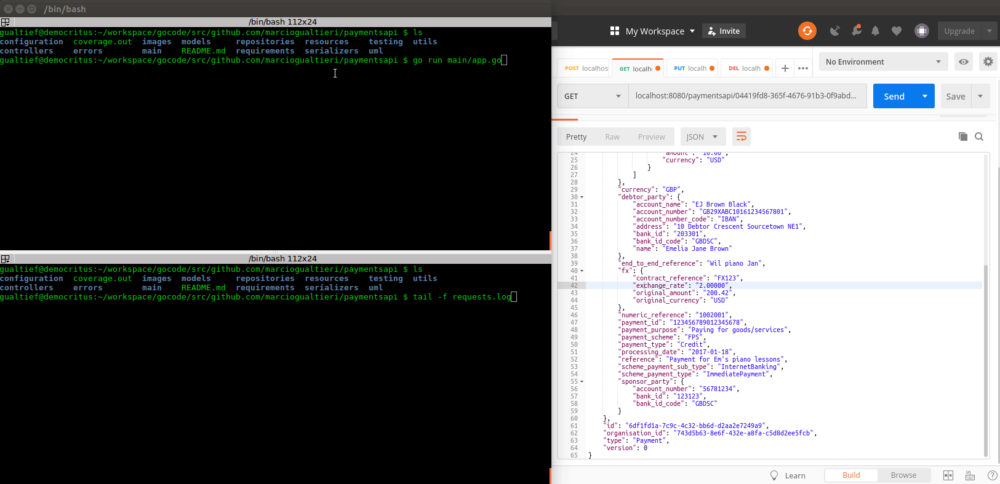
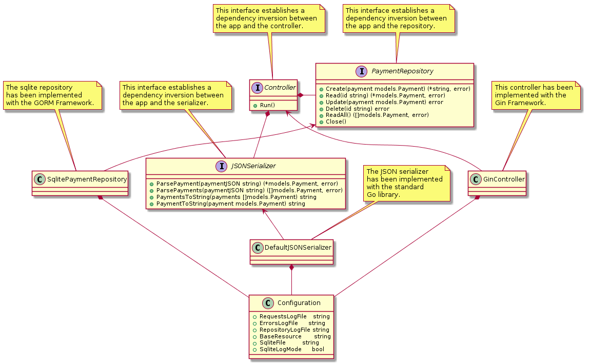
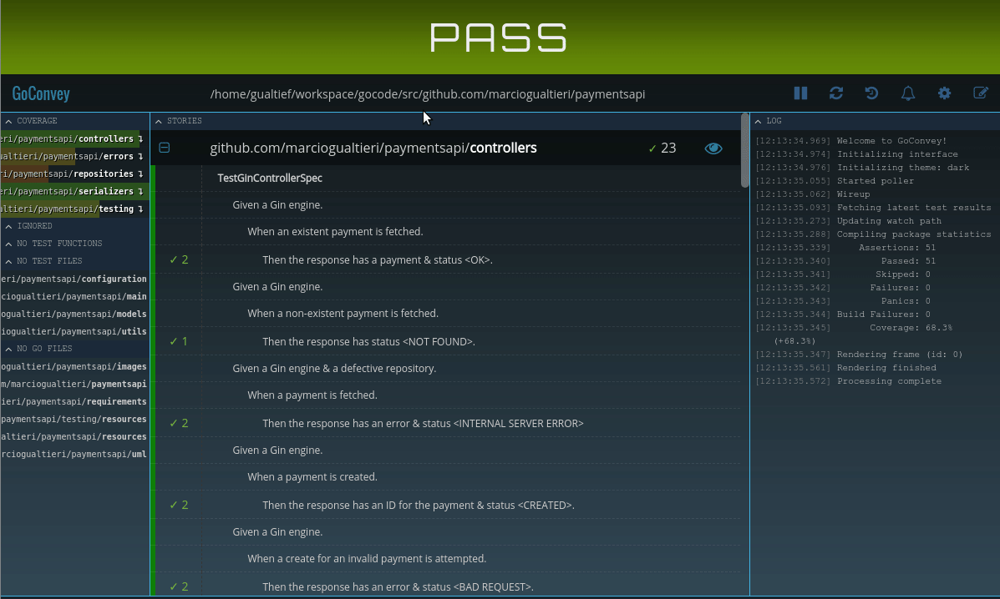
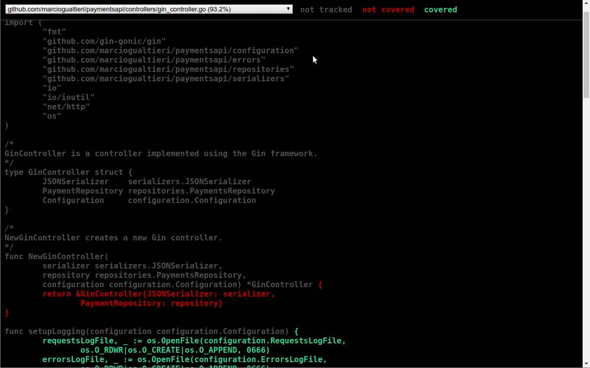

# Payments API
<!-- TOC depthFrom:1 depthTo:6 withLinks:1 updateOnSave:1 orderedList:0 -->

- [Payments API](#payments-api)
	- [Overview](#overview)
	- [Design](#design)
	- [Dependencies](#dependencies)
	- [Configuration](#configuration)
	- [Running Tests](#running-tests)
	- [Coverage reports](#coverage-reports)
	- [Developer's Guide](#developers-guide)
		- [Generated Files](#generated-files)
		- [JSON to Go Struct](#json-to-go-struct)
		- [Convey](#convey)
		- [GORM](#gorm)

<!-- /TOC -->
## Overview

The purpose of this project is to showcase my back-end development skills in Golang. In short, this app consists of a RESTful API with database persistence capabilities.

The full set of features can be found in [these requirements](./requirements/Form3_API_Coding_Exercise.pdf), as well as in the [automated tests](./controller/gin_controller_test.go), which have been implemented using BDD.

## Design

The app follows a standard MVC architecture. The controller has been implemented with the [Gin Web Framework](https://github.com/gin-gonic/gin), the model with the [GORM library](http://doc.gorm.io) (model), and the view (JSON serializer) with Go's standard library.

Note in the class diagram above the dependency inversion principle being applied to both the model, view and controller, particularly by the definition of these three interfaces:

- `PaymentRepository`, which defines an interface for the persistence layer. The current implementation of this interface is `SqlitePaymentRepository`, which uses GORM for ORM and Sqlite for the database.

- `JSONSerializer`, which defines an interface for the JSON serializer. The current implementation of this interface is `DefaultJSONSerializer`, which uses the default Golang library.

- `Controller`, which defines an interface for the controller. The current implementation of this interface is `GinController`, which uses the Gin Framework.

This allows multiple implementations for all of these components using different frameworks with minimum impact on the app in case we decide to re-implement them.

## Dependencies

To install all projects dependencies, run the following command on a terminal:

    go get ./...

Here's a list of web resources for all external dependencies:

- [Gin Web Framework](https://github.com/gin-gonic/gin) (for the controller).
- [GORM](http://doc.gorm.io) (for the model).
- [Moq](https://github.com/matryer/moq) (for mocking in tests).
- [GoConvey](https://github.com/smartystreets/goconvey) (for BDD tests).
- [properties](https://github.com/magiconair/properties) (for parsing property files).

## Configuration

The app is can be configured through properties files:

- [./resources/configuration.properties](./resources/configuration.properties) for production.
- [./testing/resources/configuration.properties](./resources/configuration.properties) for tests.

The following parameters are supported at the moment:

|Property               |Description                                                        |
|-----------------------|-------------------------------------------------------------------|
|requests.log.file      |Request logging file path.                                         |
|errors.log.file        |Error logging file path.                                           |
|repository.log.file    |Repository logging file path                                       |
|base.resource          |RESTful API base resource path                                     |
|sqlite.database.file   |Sqlite database file path. For in-memory database use ":memory:".  |
|sqlite.log.mode        |Sqlite logging mode. "true" for logging, "false" otherwise.          |

## Running Tests

To run tests, execute the following command on a terminal:

    go test -v ./...

You should get an output similar to the following:

    === RUN   TestGinControllerSpec

      Given a Gin engine.
        When an existent payment is fetched.
          Then the response has a payment & status <OK>. ✔✔

    2 total assertions

      Given a Gin engine.
        When a non-existent payment is fetched.
          Then the response has status <NOT FOUND>. ✔

    3 total assertions

      Given a Gin engine & a defective repository.
        When a payment is fetched.
          Then the response has an error & status <INTERNAL SERVER ERROR> ✔✔

    5 total assertions
    ...

You may also generate HTML reports by executing the following command:

    $GOPATH/bin/goconvey

The command will start a web server and open your browser with the url [http://127.0.0.1:8080/](http://127.0.0.1:8080/):

## Coverage reports

To generate coverage reports execute the following command:

    go test -v ./... -coverprofile=coverage.out

To inspect the results in HTML execute the following command:

    go tool cover -html=coverage.out

You may execute them altogether:

    go test -v ./... -coverprofile=coverage.out; go tool cover -html=coverage.out

This should open the HTML report in your default browser:

## Developer's Guide

### Generated Files

The mockups for the repository interface are generated by Moq. To regenerate them run the following command:

    go generate -v ./...

### JSON to Go Struct

To convert JSON to a struct easily, you may use [this on-line tool](https://mholt.github.io/json-to-go/).

Another option is [gojson](https://github.com/ChimeraCoder/gojson). To generate a struct from a JSON file using gojson, execute the following command:

    go:generate gojson -subStruct -pkg=models -name=Payment -input ../testing/resources/test_payment.json -o payments_gojson_generated.go

### Convey

For my own future reference, [here](https://github.com/smartystreets/goconvey/wiki/Assertions) is a list of [Convey](https://github.com/smartystreets/goconvey)'s assertions.

### GORM

For my own future reference, [here](http://gorm.io/docs/connecting_to_the_database.html) a list of supported databases and correspondent configuration info.
